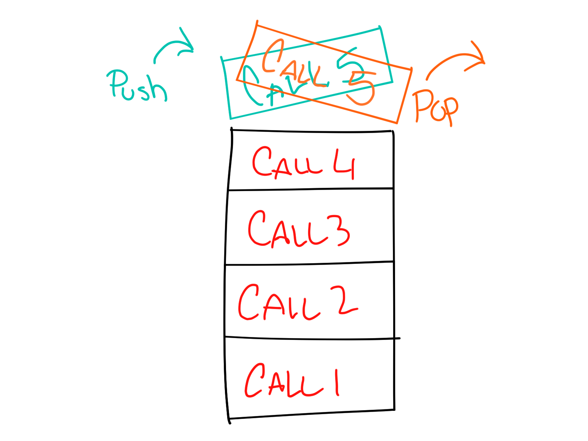

# Code 301 Reading Notes

1. [Introduction to React and Components](code-301.md#introduction-to-react-and-components)
2. [State and Props](code-301.md#state-and-props)
3. [Passing Functions as Props](code-301.md#passing-functions-as-props)
4. [React and Forms](code-301.md#react-and-forms)
5. [Putting it all Together](code-301.md#putting-it-all-together)
6. [Node.js](code-301.md#nodejs)
7. [REST](code-301.md#rest)
8. [APIs](code-301.md#apis)
9. [Functional Programming](code-301.md#functional-programming)
10. [In Memory Storage](code-301.md#in-memory-storage)
11. [Mongo and Mongoose](code-301.md#mongo-and-mongoose)

---

# Introduction to React and Components

## Component-Based Architecture

 * A component is a modular, reusable software object that is designed to interoperate with other components.
 * The [characteristics of a component](https://www.tutorialspoint.com/software_architecture_design/component_based_architecture.htm#characteristics-of-components) are:
     * **Reusability**
     * **Replaceable**
     * **Not context specific**
     * **Extensible**
     * **Encapsulated**
     * **Independent**
 * The [advantages of component-based architecture](https://www.tutorialspoint.com/software_architecture_design/component_based_architecture.htm#advantages) are:
     * **Ease of deployment**
     * **Reduced cost**
     * **Ease of development**
     * **Reusable**
     * **Modification of technical complexity**
     * **Reliability**
     * **System maintenance and evolution**
     * **Independent**

## Props in React

* `props` is short for "properties"
* Props are used in React to pass information between React components
* Information is passed down from parent component to child components. 

## Things I want to know more about

* The additional features available to Function or Class components
* JSX in general

---

# State and Props

Based off [the diagram](https://miro.medium.com/max/1400/0*0saPKFiTUk6W3FYp), what happens first, the ‘render’ or the ‘componentDidMount’?
* the 'render'

What is the very first thing to happen in the lifecycle of React?
* the constructor is called in the Mounting phase

Put the following things in the order that they happen: 
* constructor 
* render 
* React Updates
* componentDidMount 
* componentWillUnmount 

What does componentDidMount do?
* it is a place to set instructions that require the component to be mounted before they are run, such as event subscriptions or network requests

What types of things can you pass in the props?
* static information that you don't expect to change

What is the big difference between props and state?
* Props are passed from without and cannot change, state is managed from within and is mutable

When do we re-render our application?
* Any time state changes

What are some examples of things that we could store in state?
* anything that may change through user interaction or that requires the component to be re-rendered

## Things I want to know more about
* state seems to be spoken of as if it is an object all its own--is there a state object, or are we just talking about the variables a component might use in general to manage internal data?

---

# Passing Functions as Props

## React Docs - lists and keys

* `.map()` returns a new array in which each element is the result of a callback function applied to each element of the source array.
* looping through an array in JSX is nearly identical as in JS.
* each list item needs a unique key.
* the purpose of the key is to help React know when items have changed.

## Spread operator

* The spread operator is a quick way to copy the data from an object or array and use it elsewhere
* Can be used:
    * in the place of arguments for a function call
    * in the place of elements in an array literal
    * in an object expression in place of key value pairs for an object literal
    * in place of `Function.prototype.apply()`
* To combine to arrays:
```
arrA = [...arrA, ...arrB];
```
* To add new items to an array:
```
let arrA = ['3', '2', '1']
let arrB = ['Ready?, ...arrA, 'Let's jam.']
```
* To combine two objects into one:
```
let combinedObj = { ...objA, ...objB } 
```

## How to pass functions between components

* The first step is to create the function within the object where the state that needs to change is located.
* In the [example video](https://www.youtube.com/watch?v=c05OL7XbwXU), the `increment` function takes a string argument and maps a state array through a callback function that increments the appropriate state object's `count` property based on the argument.
* A method is passed from a parent component to a child component as a prop.
* The method is invoked by accessing it from props through dot notation and initializing it.

## Things I want to know more about
* Nothing came to mind this time. It all seems pretty straightforward.

---

# React and Forms

## React Docs - Forms

* A 'Controlled Component' is an input form element whose value is controlled by React.
* The user's responses are stored as they are entered because the 'source of truth' for the input element's data is the React component state.
* If there is an event handler on an input field, in order to target what the user is entering we apply a name property to the elements, which we can reference through the `event` object.

## The Conditional (Ternary) Operator

* We use a ternary operator to shorthand and if/else statement.
* Example:
```
if(x===y){
  console.log(true);
} else {
  console.log(false);
}
```
becomes:
```
x === y ? console.log(true) : console.log(false);
```

## Things I want to know more about
* I have no further questions.

---

# Putting it all Together

## Thinking in React

* The **single responsibility principle** is a software engineering principle that states a software object should only ever have one reason to change.  In other words, it should exist in a state where it is only *responsible* for performing a *single* task. In terms of a React component, we should prefer creating a new component any time a new functionality must be added to the app, rather than adding that functionality to an existing component.  That way, if any one of those components needs to be edited it will likely only be for one reason--to ensure the sole responsibility of the component works correctly.
* A 'static' version of the application is made first primarily because the basic structure of a static application requires a lot of typing, but is not complex enough to require a lot of forethought. Conversely, interactivity involves making small, well thought-out additions to the code, and is therefore best saved for last.
* After building the static app, we must next identify the complete minimal representation of UI state.
* [Three questions you can ask to determine if something is state](https://reactjs.org/docs/thinking-in-react.html#step-3-identify-the-minimal-but-complete-representation-of-ui-state):
    * Is it passed in from a parent via props? If so, it probably isn’t state.
    * Does it remain unchanged over time? If so, it probably isn’t state.
    * Can you compute it based on any other state or props in your component? If so, it isn’t state
* [To determine where a piece of state should live](https://reactjs.org/docs/thinking-in-react.html#step-4-identify-where-your-state-should-live), for each piece of state in the app:
    * Identify every component that renders something based on that state.
    * Find a common owner component (a single component above all the components that need the state in the hierarchy).
    * Either the common owner or another component higher up in the hierarchy should own the state.
    * If you can’t find a component where it makes sense to own the state, create a new component solely for holding the state and add it somewhere in the hierarchy above the common owner component.

## Higher-Order Functions

* A higher-order function is a function that either takes another function as an argument or returns one.
* In the below example code, line 2 returns an anonymous function that compares the argument `n` from the higher-order function `greaterThan(n)` to its own argument `m` with the greater than operator.
```
function greaterThan(n) {
  return m => m > n;
}
let greaterThan10 = greaterThan(10);
console.log(greaterThan10(9));
```
<sup>https://eloquentjavascript.net/05_higher_order.html#h_xxCc98lOBK</sup>

* The `Array.prototype.map()` method is another example of a higher-order function. It takes a function as an argument, passes each element of an array into that lower-order function, and returns a new array with the results of the function applied to each element.

## Things I want to know more about
Are delegate functions a thing in JS?

---

# Node.js

## An Introduction to Node.js

* Node.js is a JavaScript runtime environment built on the V8 JavaScript Engine.
* Chrome's V8 JavaScript Engine is what compiles JavaScript in Chromium-based web browsers.
* npm is a package manager for Node.js -- it stands for 'Node Package Manager'
* Currently installed Node.js version: v16.13.2
* Currently installed npm version: 8.1.2
* To install a package globally: `npm install -g jshint`
* Node allows us to run JavaScript server side, and is particularly good at handling lots of real-time interaction requests.

## 6 Reasons for Pair Programming

* The six reasons are:
    * Greater efficiency
    * Engaged collaboration
    * Learning from fellow students
    * Social skills
    * Job interview readiness
    * Work environment readiness
* I particularly appreciate the collaboration.  It's easy to notice someone else's small mistakes, it's helpful to have someone else's favorite shortcuts onhand, and it's fun to see how other people approach a problem.
* Pair programming works by splitting the tasks of program witing into two--one person doing the typing, and one person dictating what is to be typed. 

## Things I want to know more about
I'm excited to learn more about untethering JS from the browser!

---

# REST

## How I explained REST to my brother

* Roy Fielding was an early Internet developer and researcher who helped write the HTTP protocol.
* The techniques we use today don't work well when talking to all the machines in the world because they were not developed with that use in mind.
* The Hypertext Transfer Protocol (HTTP) is the means through which locations on the Internet can be described.
* `GET` retrieves a representation of a resource from a URL
* `POST` adds a representation of a resource to a system via a URL
* `PUT` replaces a representation of a resource with another. 
* `PATCH` partially updates a representation of a resource.

## API Keys

Geocoding API
Did you get your API key? yes.
Weather Bit API
Did you get your API key? yes
Yelp API Docs
Did you get your API key? yes
The Movie DB API Docs
Did you get your API key? yes

---

# APIs

## API Design Best Practices

* REST stands for Representational State Transfer
* REST APIs are designed around objects, data and services accessible to the client.
* A URI (Uniform Resource Identifier) is used to uniquely distinguish resources.  A common example is an HTTP URL.
* The most common HTTP verbs are GET, POST, PUT, PATCH, and DELETE.
* URIs should be based on the resource, not the operation on the resource.
    * Good example: `https://resource-site.com/resource`
    * Bad example: `https://resource-site.com/retrieve-resource`
* Because an increase in requests comes with an increase in server load, it is preferrable to avoid 'chatty' web APIs with a large number of small resources. Instead, bundle related resources into packages which can be sent once and dissected locally for further details.
* Status codes:
    * `GET` success: 200 (OK)
    * `GET` failure: 404 (Not Found)
    * `POST` success: 201 (Created)
    * `DELETE` success: 204 (No Content)

## Things I want to know more about
Nothing comes to mind at this hour.

---

# Functional Programming

* Functional programming is a style of programming which focuses on using function evaluations as the primary vehicle for computations and avoiding mass mutable state.
* A pure function returns the same result when given the same data, and it doesn't have any unintended effects on other parts of the program.
* Testing pure functions is very easy because the input and output is dependable.
* Immutability means the state of a function does not change at runtime.
* Referential transparency means the function returns the same information from the same arguments.

---

# In Memory Storage

## Understanding the JavaScript Call Stack

* A 'call' usually refers to a function call.
* Only one call can happen at once
* LIFO - Last in, first out

* The stack has a finite size. If the number of function calls exceed the limit (such as in a recursive function with no exit point), it is called a "stack overflow"

## JavaScript Error Messages

* `reference error` - when trying to use a variable that has not beend declared within the current scope
* `syntax error` - when using improper JS syntax that isn't fixed by JS behind the scenes magic
* `range error` - when attempting to access an index of an enumerated collection that is outside the bounds of the enumeration
* `type error` - when a type is expected other than the type provided, usually with respect to variables and function returns
* Breakpoints are used to temporarily suspend execution of a program at a specific line of code for debugging purposes.
* `debugger` statements can be used with breakpoints to reveal additional information about the program as it is executing.

## Things I want to know more about
* This was the first time I've hear of heaps in respect to JS--I hadn't noticed heaps in the documentation prior to now.

---

# Mongo and Mongoose

## SQL vs NoSQL

```
    SQL     |     NoSQL  
------------------------------
Relational  | Non-realtional
------------------------------
Table-based | Document-based 
            | key-value pairs
------------------------------
Predefined  | Dynamic schema
schema      | 
------------------------------
Vertically  | Horizontally
scalable    | scalable
------------------------------
Uses SQL    | Uses UnQL
------------------------------
```
* SQL is a good fit for environments where complex queries are frequent.
    * Examples: MySql, Oracle, Sqlite, Postgres and MS-SQL.
* NoSQL is a good fit for hieratchical data storage and large data sets.
    * Examples: MongoDB, BigTable, Redis, RavenDb, Cassandra, Hbase, Neo4j and CouchDb
    
* SQL - Structured Query Language
* A relational database is a databse that uses tables and fields.
* The schema is the ordering of data in the table.
* NoSQL - uses key-value pairs in order to store data
* NoSQL databases work by creating collections of documents
* Inside a Mongo databse is no or very few relations
* NoSQL is more flexible because you do not have to apply a schema to the whole collection
* One disadvantage of NoSQL is it loses it's performance when dealing with lots of queries to one collection

## Things I want to know more about
* How does Mongoose figure into this?  It wasn't mentioned.
