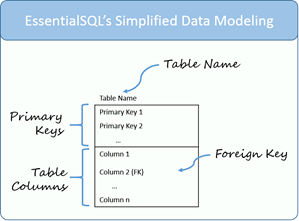
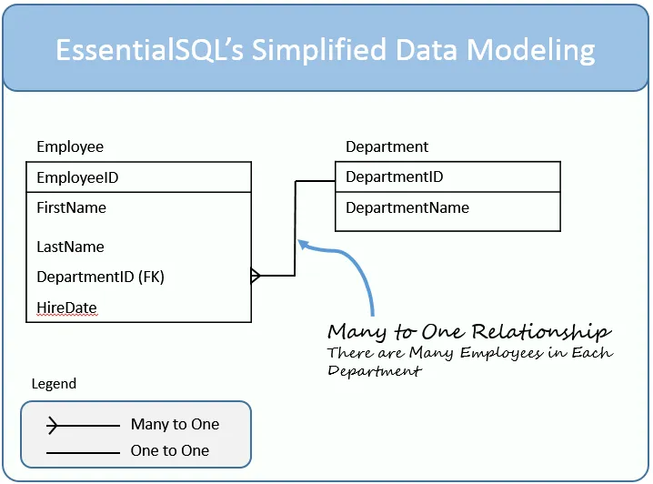
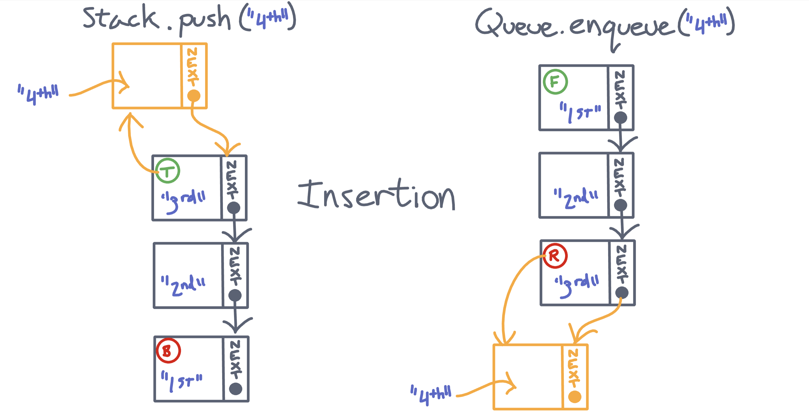
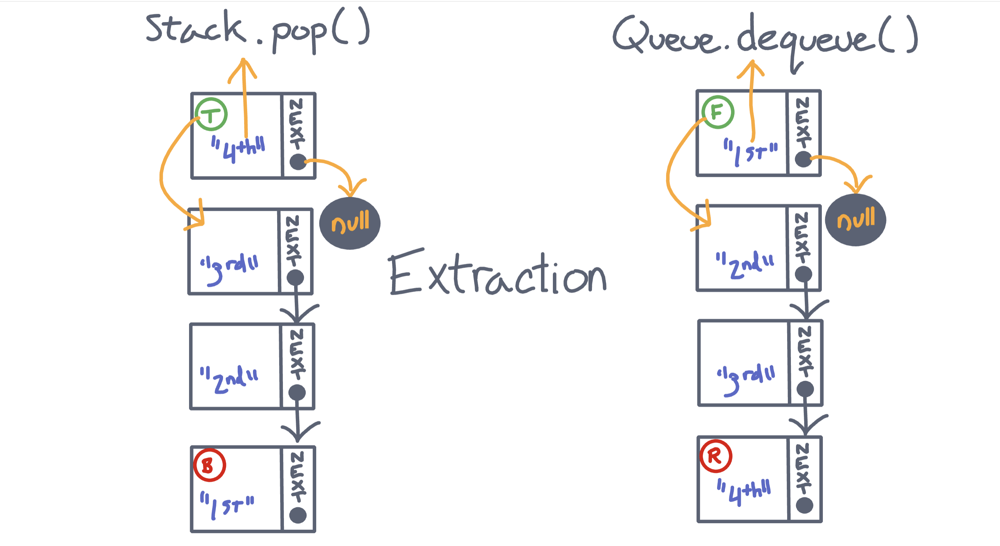

# Code 401 Reading Notes

1. [Introduction to SQL](code-401.md#introduction-to-sql)
2. [Practice in the Terminal](code-401.md#practice-in-the-terminal)
3. [Get Ready for 401](code-401.md#get-ready-for-401)
4. [Node Ecosystem, TDD, CI/CD](code-401.md#node-ecosystem-tdd-cicd)
5. [Express](code-401.md#express)
6. [Express REST API](code-401.md#express-rest-api)
7. [Data Modeling](code-401.md#data-modeling)
8. [Authentication](code-401.md#authentication)
9. [Bearer Authorization](code-401.md#bearer-authorization)
10. [Access Control](code-401.md#access-control)
11. [Stacks and Queues](code-401.md#stacks-and-queues)
12. [Event Driven Applications](code-401.md#event-driven-applications)
13. [Socket.io](code-401.md#socketio)
14. [Message Queues](code-401.md#message-queues)
15. [Event Driven Architecture](code-401.md#event-driven-architecture)
16. [Trees](code-401.md#trees)
17. [AWS: Cloud Servers](code-401.md#awscloud-servers)

---

# Introduction to SQL

In general, relational databases organize data into column-major tables.  These tables can include a column (or several) of unique KEY values. By creating a relationship between the keys on tables we can store related data accross many tables to compartmentalize information for efficient storage. In this way, one can more easily access only the relevant information without having to sort through all the information related to a given key.

The method of querying, creating, modifying and deleting elements of a relational database or its data is SQL, a language that uses plain and simple language to construct potentially complex queries without a heap of technical knowledge.


---

# Practice in the Terminal

The [Bash tutorials](https://ryanstutorials.net/linuxtutorial/) were a good refresher on useful commands for the terminal. I've been using Linux/Unix and Bash on and off for much of my professional career, and before that the first operating system I'd ever used was command-line DOS. So I feel pretty comfortable overall using the terminal to crawl through file and directory trees and do what I need to do.  One thing I noticed that I don't think I've ever had occasion to use is `CTRL + Z`, which I wonder if it might be useful when I want to use the CLI while I'm hosting a server from a terminal rather than killing the server session with `CTRL + C` and then restarting it after I do whatever it is I needed to do.

Also, I appreciate that there's a way to handle spaces in file names but... why would you? Sounds like an invitation to disaster if you ask me.

---

# Get Ready for 401

## Solving Problems

The author of [this article](https://simpleprogrammer.com/solving-problems-breaking-it-down/) suggests a seven-step approach to breaking a problem down and solving it.  Those seven steps are:

1. Read the problem completely twice.  Maybe even 3 or 4 times. Understand the problem before moving forward.
3. Solve the problem manually with 3 sets of sample data. Don't forget to look out for edge-cases and corner-cases along the way.
4. Optimize the manual steps. Find an easier solution, if possible.
5. Write the manual steps as comments or pseudo-code. If you feel you have a handle on the problem, possibly skip this step.
6. Replace the comments or pseudo-code with real code.
7. Optimize the real code, if necessary.

## Act like you make $1000/hr

[ERROR 410 - The Author Deleted this Story](https://medium.com/swlh/pretend-your-time-is-worth-1-000-hour-and-youll-become-100x-more-productive-f04628bb3e6d)

## How to think like a programmer

In [this article](https://www.freecodecamp.org/news/how-to-think-like-a-programmer-lessons-in-problem-solving-d1d8bf1de7d2) the author suggests there are four elements to thinking like a programmer--i.e. focusing on problem solving.  The four elements are:

1. Understand. Like above, the key to solving a problem begins with understanding the essence of the problem in simple terms.
2. Plan. Again, the author suggests that making a plan before you code is the preferred course. This involves modeling inputs and outputs through an algorithm.
3. Divide. Break the problem into sub-problems. By solving each sub-problem you invariably arrive at the solution for the whole problem.
4. Debug/Reassess/Research. If you get stuck, these three approaches can help get past the blocker. Search for flaws in your instructions, check the problem from a new perspective, or get out there and Google up a solution.

## The 5 Whys

The [5 Whys](https://www.mindtools.com/pages/article/newTMC_5W.htm) is a problem discovery technique which is designed to explore the possible causes of a problem and thus lead to potential mitigating counter-measures for any causes that can be mitigated. This technique was developred by Sakichi Toyoda, of Toyota Industries fame, in the 1930's.  It focuses on simplicity, flexibility, and getting first-hand data.

The steps of the process are:

1. Assemble a Team - people with direct knowledge of the issue
2. Define the Problem - make sure there is a concrete understanding of the issue at hand
3. Ask the First "Why?" - discover one or more potential causal factors driving the issue
4. Ask "Why?" Four More Times - drill down with greater specificity following each causal chain to its root cause
5. Know When to Stop - when further questions do not produce useful responses, stop
6. Address the Root Cause(s) - implement the counter-measures
7. Monitor your Measures - guage the effectiveness of counter-measures and refine as necessary

## What the heck is the event loop anyway

The event loop is a system that maintains a queue of asynchronous callback functions requested by the user, and calls those functions into the stack when appropriate. The event loop allows the normal call stack to continue running without becoming blocked by instructions which take a long time to execute.  The event loop queue only dequeues the first callback if the stack is clear, ensuring smooth operation of asynchronous code.

## The Super Mario Effect

The Super Mario Effect refers to the gamification of complicated tasks to enhance learning and retention.  The eponymous example, Super Mario, ultimately boils down to pressing a series of buttons in an exact sequence at the appropriate time--stripped of all other context, this task sounds mind-numbingly boring. But, dressed up as a game with colorful cartoon graphics and loads of positive reinforcement the task becomes highly engaging and the skills are easier to retain.  The presenter demonstrates that this approach to learning can make a large difference in a person's willingness to re-attempt a task after a failure.

---

# Node Ecosystem, TDD, CI/CD

## Review, Research, and Discussion

### `Array.map()`

This method iterates over the elements of the source array, applies a callback function to each element, and then returns a new array of the resulting elements. The method can accept two optional parameters: one to reference the integer index of the current iteration, and one to reference the source array.

### `Array.reduce()`

This method iterates over the elements of the source array, applies a callback function to each element that alters the value of an 'accumulator' variable based on the result of logical statements within the callback function, and returns a single value (that of the accumulator). The method can accept as an optional parameter an initial value for the accumulator (e.g. an empty object `{}` or the number `0`). If this optional parameter is left undefined, the accumulator will be assigned the value of the first element in the source array.

### `superagent()`

The superagent plugin provides asynchronous functions for creating HTTP requests.  To fetch data from a URL and log the result there are two syntaxes:

As a promise:
```js
superagent
  .get(URL)
  .then(data => console.log(data.body));
```
Or with an async function:
```js
async function getUrl(url) {
  let data = await superagent.get(url);
  console.log(data.body);
}
```

### Promises

A Promise is a way to handle asynchronous code, much like `async` and `await`. When a promise is created, it attempts to resolve the asynchronous operation. Once the promise resolves (or is rejected with some status information) a `.then()` method must be in place to supply a callback function on the resolution to fulfill the promise.

### Not All Callback Functions are Asynchronous

A callback function is any function that is passed as an argument to another function with the expectation that the callback will be eventually called within the hosting function. This is not always an asynchronous operation--but all asynchronous operations use callback functions in some way, so they are commonly associated with asynchronicity.

---

# Express

## `PUT` vs `PATCH`

`PUT` is used to create a resource or to update an entire resource. `PATCH` is used to partially update a resource.

## Mock API Sites

To test or prototype an API, you can use one of the following sites:

* [Mockend](https://mockend.com/)
* [Beeceptor](https://beeceptor.com/)
* [Go REST](https://gorest.co.in/)

## Swagger vs APIDoc.js

Swagger is highly interactive, colorful, and full of features.  It also seems to have a bunch of other tools besides those for documentation. I didn't dive too deep, but it appears to run on its own software platform.  I didn't see an npm package or a cli download anywhere.

APIDoc.js appears to be filling its niche; rather than the massive network of integrated tools it's just a simple package for generating good-looking documentation from your code. The documentation produced doesn't have all the interactive frills, either--though there could be options for that sort of thing, nothing like it was shown in the demo. It looks like this package runs entirely from the command line.

## Status Codes:

* 100’s = Information
* 200’s = Success
* 300’s = Redirection
* 400’s = Client error
* 500’s = Server error

## SOAP vs REST

The major difference between these two acronyms is that one (REST) is an architectural guide for systems that communicate and the other (SOAP) is a protocol for communication. 

REST is a set of overarching principles for web API architecture. It dictates a standardized form of resource transfer between clients and servers, but is flexible about the form of the data itself. SOAP is far less rigid, requiring XML formatted data. It is also slower, and does not have the ability to access the browser cache.

## Vocabulary Terms

* Web Server - a computer that maintains a consistent connection to the web and is configured to receive and process communications from/to client computers.
* Express - A popular Node web framework that handles HTTP requests and processes middleware between requests for information and the following response.
* Routing - The act of directing the flow of information using URL paths.
* WRRC - The Web Request Response Cycle is a model for how client/server communications are handled (via 'requests' and 'responses')

---

# Express REST API

## Review: ES6 Classes

Classes are a clean and efficient way of bringing object-oriented programming into JavaScript. They mimic the function of adding methods and properties to an object prototype. 

## Using Express Routing

Routing is the means by which an application recieves client requests for information.  Basic routing in Express is accomplished by accessing the Express instance's routing methods, which correspond to the RESTful verbs used by modern APIs (`GET` and `get()`, etc...). Below is one example of such a route:

```js
const express = require('express')
const app = express()

// respond with "hello world" when a GET request is made to the homepage
app.get('/', (req, res) => {
  res.send('hello world')
})
```
<sup>Source: https://expressjs.com/en/guide/routing.html</sup>

## Express Router

Another way to designate a route is to use the Express router.  See below example:

```js
var router = express.Router();

router.get('/', function(req, res) {
  res.send('im the home page!');
});
```
<sup>Source: https://www.digitalocean.com/community/tutorials/learn-to-use-the-new-router-in-expressjs-4</sup>

---

# Data Modeling

## NOSQL vs SQL

```
    SQL     |     NoSQL  
------------------------------
Relational  | Non-relational
------------------------------
Table-based | Document-based 
            | key-value pairs
------------------------------
Predefined  | Dynamic schema
schema      | 
------------------------------
Vertically  | Horizontally
scalable    | scalable
------------------------------
Uses SQL    | Uses UnQL
------------------------------
```
* SQL is a good fit for environments where complex queries are frequent.
    * Examples: MySql, Oracle, Sqlite, Postgres and MS-SQL.
* NoSQL is a good fit for hierarchical data storage and large data sets.
    * Examples: MongoDB, BigTable, Redis, RavenDb, Cassandra, Hbase, Neo4j and CouchDb
    
* SQL - Structured Query Language
* A relational database is a database that uses tables and fields.
* The schema is the ordering of data in the table.
* NoSQL - uses key-value pairs in order to store data
* NoSQL databases work by creating collections of documents
* Inside a Mongo database is no or very few relations
* NoSQL is more flexible because you do not have to apply a schema to the whole collection
* One disadvantage of NoSQL is it loses it's performance when dealing with lots of queries to one collection

## SQL Data Modeling Techniques

In [this article] the author shows a few ways to model representational databases.  The simple model looks like this:


And a more complex relationship can be seen here:



These models show all the key parts of an SQL data model and the relationships between tables.  Note the "many-to-one" indicator.

---

# Authentication

## Securing Passwords with Bcrypt Hashing

Cryptographic hashing is a way of encrypting plain-text passwords into long strings of seemingly random characters. This provides good protection for a user's password, because if the server is compromised the attackers only get the hash, not the full password.  This encryption is not foolproof, but it does present a hurdle to a would-be hacker.

To enhance security, we can add BCrypt, which uses a technique called Key Stretching to make the hash extremely resistant to brute force attacks.

## Basic Auth

The simplest form of authetication is called basic access authentication.  This method does not require cookies, session identifies, login pages, etc. All information for authentication can be sent via the HTTP header.  This is not perfect security--the credentials are encoded with Base64, but not encripted. For this reason, HTTPS is often used alongside basic auth to add additional security.

---

# Bearer Authorization

## What is JSON Web Token (JWT)?

JWT is a compact open standard to securely transfer information between any two bodies. The token is 'digitally signed' to ensure information transferred is verified. It can be transmitted quickly and used easily. The token contains the user's information meaning the database only needs to be queried once and then the token can be used to verify the user's authorized access.

The JWT comes in three parts: a header, the payload, and the signature.
  * The header includes information about the algorithm used to encode the token.
  * The payload contains the data to be transferred.
  * The signature contains the data of both the header and the payload plus a 'secret.' This section ensures that the data in the payload can be verified and trusted.

## How does JWT Work?


<sup> Source: https://jwt.io/introduction/ </sup>

1. The application or client requests authorization to the authorization server. 
2. When the authorization is granted, the authorization server returns an access token to the application.
3. The application uses the access token to access a protected resource (like an API).

---

# Access Control

## 5 Steps to Simple Role-Based Access Control

1. Inventory your systems - understand where you need to control access
2. Analyze your workforce and create roles. Keep them as simple and stratified as possible.
3. Assign people to roles.
4. Never make one-off changes.
5. Audit periodically.

## Role-Based Access Control

Three primary rules are defined for RBAC:
  1. Role assignment: permission is reserved for those assigned a role.
  2. Role authorization: to ensure users can only assume a role for which they are authorized.
  3. Permission authorization: permissions must match those of the authorized role.

Permissions are associated with a role, not a user.

---

# Stacks and Queues

## Stack

A stack is a type of singly linked list where the nodes are ONLY added or removed to/from the front of the list. Stacks have extra methods designed to accomplish this: `push()` to add and `pop()` to remove and `peek()` to look at the top value without removing it. Because of this specific usage, the Stack is known as a 'first-in/last-out' data structure.  A common example of a stack is the 'call stack.'

## Queue

A queue is a type of singly linked list where the nodes are ONLY added to the rear of the list and removed from the front of the list. Queues have extra methods designed to accomplish this: `enqueue()` to add and `dequeue()` to remove, and `peek()` to look at the front value without removing it. Because of this specific usage, the Queue is known as a 'first-in/first-out' data structure. A common example of a queue is the event queue.



---

# Event Driven Applications

Event driven architecture relies on using the [Observer Design Pattern](https://en.wikipedia.org/wiki/Observer_pattern) to register a list of delegated functions to an event. When the event is invoked, all the listed function calls are also invoked. In this way, a dependency between one and several modules can be inverted, so that all modules involved losely depend on only one other module--the event caller. This also helps encapsulate functionality more concretely as per the [Single-Responsibility Principle](https://en.wikipedia.org/wiki/Single-responsibility_principle). In an event-driven system each module controls its own behavior in response to an event, rather than allowing other modules to control its behavior by importing its functions.

Events in Node.js use the [EventEmitter module](https://nodejs.org/api/events.html), which is an included feature module of Node.

---

# Socket.io

## WebSocket

According to [Wikipedia](https://en.wikipedia.org/wiki/WebSocket), WebSocket is a communications protocol which provides full-duplex communication over a single TCP connection. This allows for web clients to communicate with a server in real-time, sending and receiving information simultaneously.

## Socket.io

Socket.io is a socket-based event library that is built on top of the WebSockerts API and Node.js. It consists of separate server-side and client-side libraries. These libraries make it possible to broadcast to many sockets at one time easily.

## OSI Model

The OSI Model is a model for the standardization of the communication between computers on a network.  There are seven layers to the model:

* Application: Network applications (web browser: HTTP, HTTPs, FTP, etc...)
* Presentation: translates, compresses, and encrypts/decrypts information from the application layer into computer readable code
* Session: Handles setting up and maintaining of connections. APIs, authentication, authorization, data transfers happen on this layer.
* Transport: Controls the reliabilability of communication via segmentation, flow control, and error control. It also handles connection oriented transmission (TCP), and connectionless transmission (UDP)
* Network: Handles routing, logical addressing, and path determination.
* Data Link: Pysical addressing is done at this layer via MAC addresses. This occurs in software on the network interface card.
* Physical: the individual physical bits of information in a given media.    

Each layer is a bundle of the protocols necessary to make applications work in the network.

## TCP 3-Way Handshake

TCP uses a 3-way handshake to establish a connection.

1. The client requests synchronization and connection.
2. The server acknowledges the synchronization and requests its own connection.
3. The client acknowledges the connection.

---

# Message Queues

## Socket.io Chat Application

A [simple chat application](https://socket.io/get-started/chat/) can be made with Node.JS, Express, and Socket.io.

index.js
```node
const express = require('express');
const app = express();
const http = require('http');
const server = http.createServer(app);
const { Server } = require("socket.io");
const io = new Server(server);

app.get('/', (req, res) => {
  res.sendFile(__dirname + '/index.html');
});

io.on('connection', (socket) => {
  console.log('a user connected');
  socket.on('disconnect', () => {
    console.log('user disconnected');
  });
  socket.on('chat message', (msg) => {
    io.emit('chat message', msg);
  });
});

server.listen(3000, () => {
  console.log('listening on *:3000');
});
```

index.html
```html
<!DOCTYPE html>
<html>
  <head>
    <title>Socket.IO chat</title>
    <style>
      body { margin: 0; padding-bottom: 3rem; font-family: -apple-system, BlinkMacSystemFont, "Segoe UI", Roboto, Helvetica, Arial, sans-serif; }

      #form { background: rgba(0, 0, 0, 0.15); padding: 0.25rem; position: fixed; bottom: 0; left: 0; right: 0; display: flex; height: 3rem; box-sizing: border-box; backdrop-filter: blur(10px); }
      #input { border: none; padding: 0 1rem; flex-grow: 1; border-radius: 2rem; margin: 0.25rem; }
      #input:focus { outline: none; }
      #form > button { background: #333; border: none; padding: 0 1rem; margin: 0.25rem; border-radius: 3px; outline: none; color: #fff; }

      #messages { list-style-type: none; margin: 0; padding: 0; }
      #messages > li { padding: 0.5rem 1rem; }
      #messages > li:nth-child(odd) { background: #efefef; }
    </style>
  </head>
  <body>
    <ul id="messages"></ul>
    <form id="form" action="">
      <input id="input" autocomplete="off" /><button>Send</button>
    </form>
    <script src="/socket.io/socket.io.js"></script>
<script src="/socket.io/socket.io.js"></script>
<script>
  var socket = io();

  var messages = document.getElementById('messages');
  var form = document.getElementById('form');
  var input = document.getElementById('input');

  form.addEventListener('submit', function(e) {
    e.preventDefault();
    if (input.value) {
      socket.emit('chat message', input.value);
      input.value = '';
    }
  });

  socket.on('chat message', function(msg) {
    var item = document.createElement('li');
    item.textContent = msg;
    messages.appendChild(item);
    window.scrollTo(0, document.body.scrollHeight);
  });
</script>
  </body>
</html>
```

---

# Event Driven Architecture

## AWS: When to use SNS or SQS

* SNS: Simple notification service
  * uses a publisher/subscriber system. 
  * Publishing can be delivered to many subscribers of different types.
  * Used when other systems care about the event.
* SQS: Simple queue service, queueuing service for message processing. 
  * The system must poll the queue to discover new events.
  * Messages in the queue are processed by a single customer.
  * Used when your system cares aboute an event.

---

# Trees

A tree is a data structure which stores values in nodes.  Each node has between 0 and (depending on the type of tree) potentially infinite child nodes. These parent/child relationships form a hierarchy, with one node that has no parent node (known as the  `root`) serving as the starting point for traversing the structure. Nodes which have a parent but no children are known as `leaves`.

## Traversal
There are two methods of tree traversal.

* Depth-First Traversal - in this method, the tree is read by first traversing to a leaf and then back up to the next higher branching before returning to any connected leaves, and so on up the tree until all leaves and branches have been traversed. The ordering of the read can be done in one of several ways, producing different results (though all nodes are visited in any read method). No matter the ordering, these methods are all recursive.
* Breadth-First Traversal - in this method, the tree is read row by row in descending order starting with the root.  Each node on a given level is read from left to right regardless of sibling/parent/child relationships. In this method, a queue is used to hold the references to previous nodes, allowing the traversal to visit all nodes without losing reference to past nodes visited.

## Binary Trees vs K-ary Trees

A binary trees are limited to between zero and two children (usually designated `left` and `right`).\

K-ary trees are limited to between zero and `k` children. While more complicated, the concepts for traversing the k-ary tree breadthwise via a queue is essentially the same.

## Binary Search Trees

These trees are similar to binary trees, but with the added sorting measure: a node's left child value must be a lesser number than the node's value, and it's right child value must be greater. This allows for very fast searching of the tree, since the structure potentially halves the viable search pool with each advance.

---

# AWS: Cloud Servers

## AWS EC2

Amazon Elastic Compute Cloud (EC2) is a platform for hosting vitual machines for cloud-native applications. Users can select from a wide array of oeprating systems and VM configurations to tailor their package to their exact needs.  

## Elastic Beanstalk

Elastic Beanstalk (EB) is a tool that handles the creation of virtual machines on EC2. It automates several of the build options, removing some of the set-up steps required to get a VM running and hosting an app. It also offers scaling solutions and load balance]ing for your server, cutting down the maintenence time/effort required to keep a server going. The CLI offers a convenient means to automate this process.

