# Code 401 Reading Notes

1. [Introduction to SQL](code-401.md#introduction-to-sql)
2. [Practice in the Terminal](code-401.md#practice-in-the-terminal)
3. [Get Ready for 401](code-401.md#get-ready-for-401)
4. [Node Ecosystem, TDD, CI/CD](code-401.md#node-ecosystem-tdd-cicd)
5. [Express](code-401.md#express)
6. [Express REST API](code-401.md#express-rest-api)

---

# Introduction to SQL

In general, relational databases organize data into column-major tables.  These tables can include a column (or several) of unique KEY values. By creating a relationship between the keys on tables we can store related data accross many tables to compartmentalize information for efficient storage. In this way, one can more easily access only the relevant information without having to sort through all the information related to a given key.

The method of querying, creating, modifying and deleting elements of a relational database or its data is SQL, a language that uses plain and simple language to construct potentially complex queries without a heap of technical knowledge.

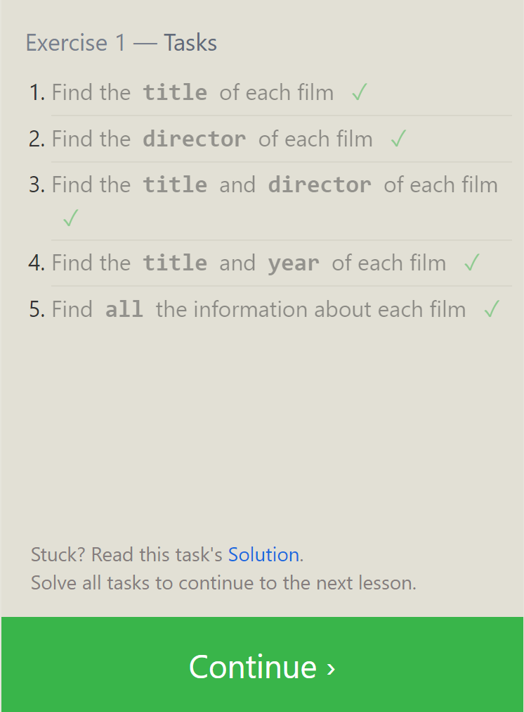
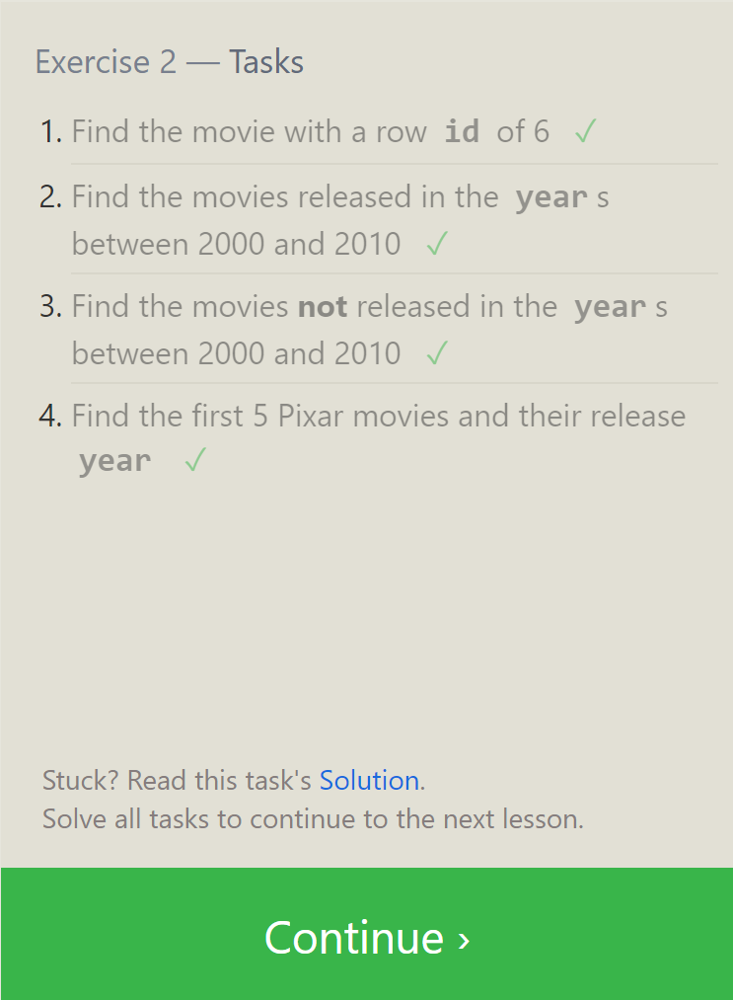
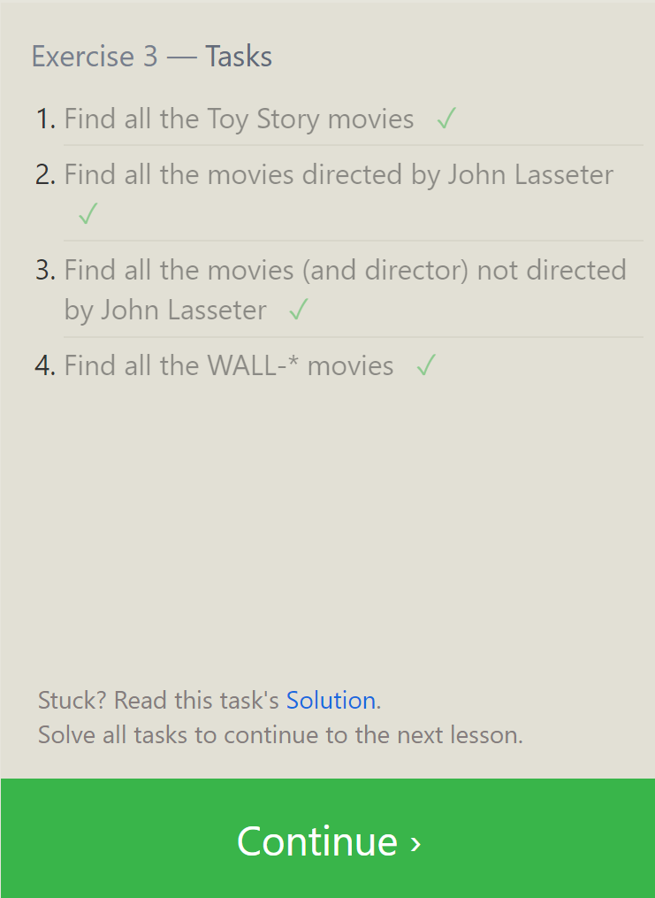
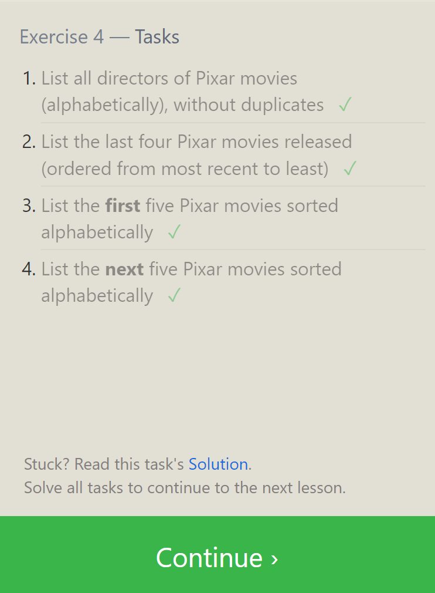
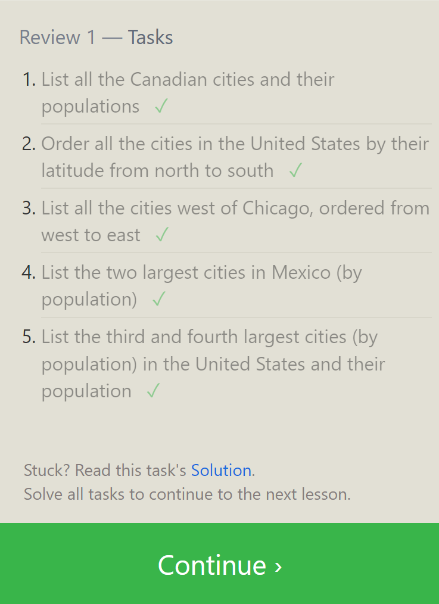
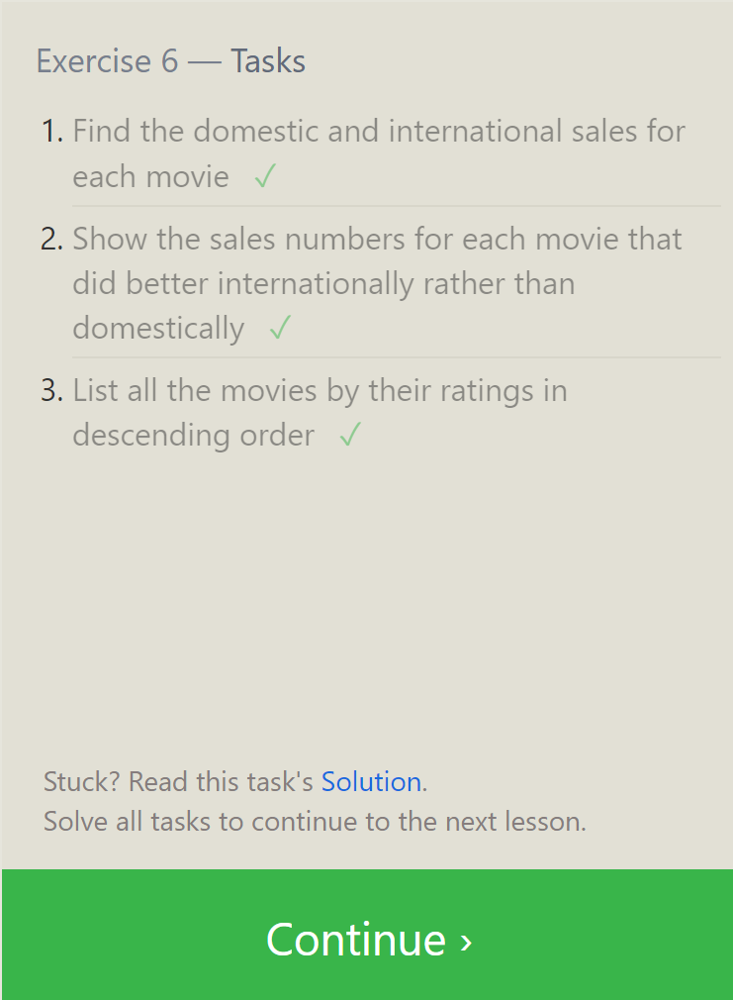
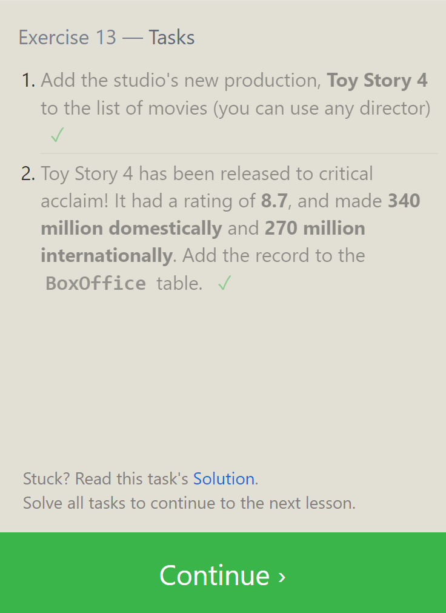
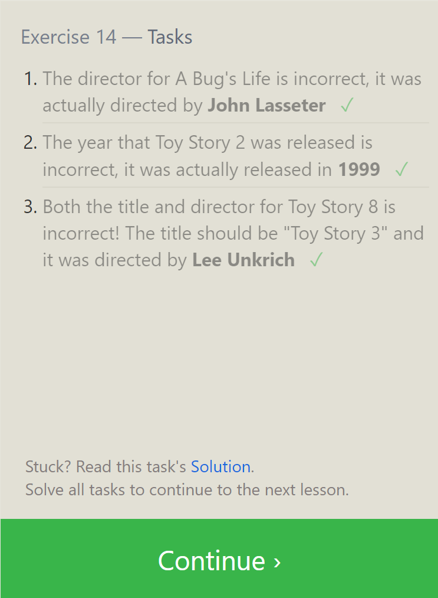
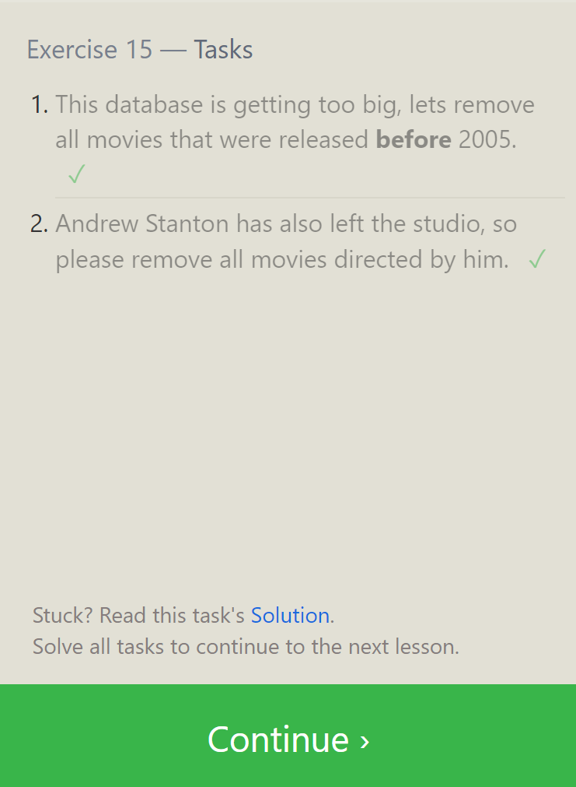
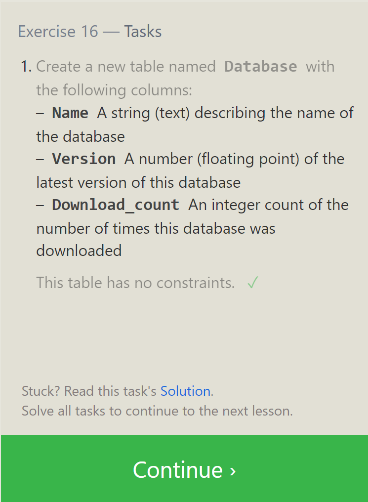
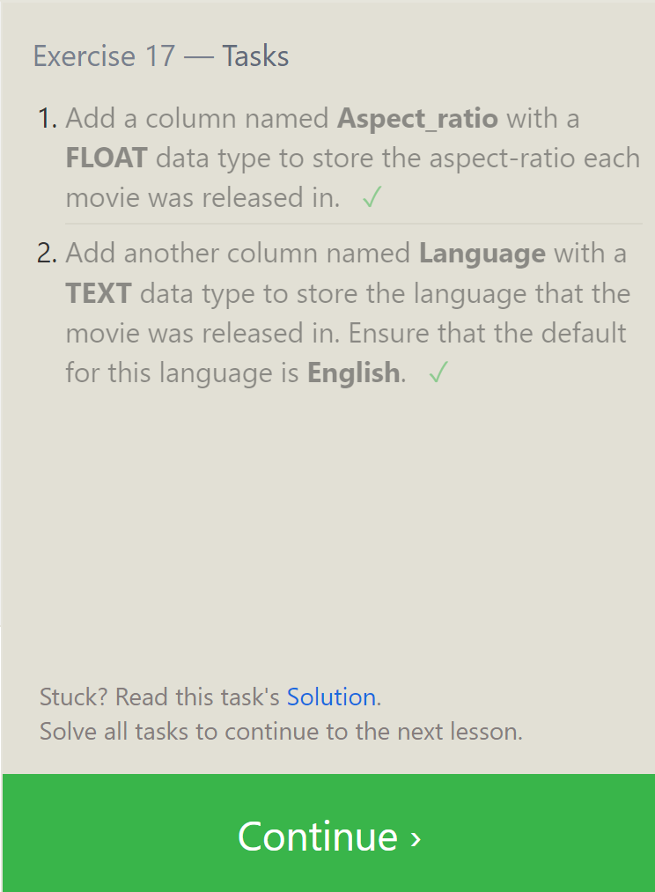
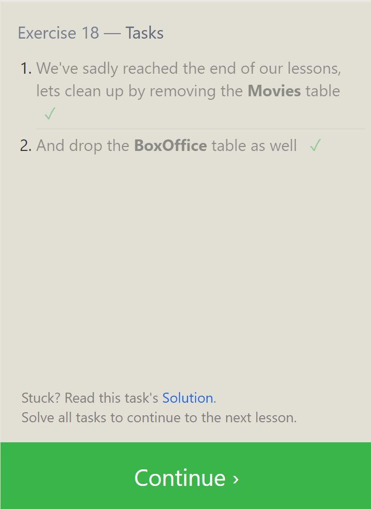

---

# Practice in the Terminal

The [Bash tutorials](https://ryanstutorials.net/linuxtutorial/) were a good refresher on useful commands for the terminal. I've been using Linux/Unix and Bash on and off for much of my professional career, and before that the first operating system I'd ever used was command-line DOS. So I feel pretty comfortable overall using the terminal to crawl through file and directory trees and do what I need to do.  One thing I noticed that I don't think I've ever had occasion to use is `CTRL + Z`, which I wonder if it might be useful when I want to use the CLI while I'm hosting a server from a terminal rather than killing the server session with `CTRL + C` and then restarting it after I do whatever it is I needed to do.

Also, I appreciate that there's a way to handle spaces in file names but... why would you? Sounds like an invitation to disaster if you ask me.

---

# Get Ready for 401

## Solving Problems

The author of [this article](https://simpleprogrammer.com/solving-problems-breaking-it-down/) suggests a seven-step approach to breaking a problem down and solving it.  Those seven steps are:

1. Read the problem completely twice.  Maybe even 3 or 4 times. Understand the problem before moving forward.
3. Solve the problem manually with 3 sets of sample data. Don't forget to look out for edge-cases and corner-cases along the way.
4. Optimize the manual steps. Find an easier solution, if possible.
5. Write the manual steps as comments or pseudo-code. If you feel you have a handle on the problem, possibly skip this step.
6. Replace the comments or pseudo-code with real code.
7. Optimize the real code, if necessary.

## Act like you make $1000/hr

[ERROR 410 - The Author Deleted this Story](https://medium.com/swlh/pretend-your-time-is-worth-1-000-hour-and-youll-become-100x-more-productive-f04628bb3e6d)

## How to think like a programmer

In [this article](https://www.freecodecamp.org/news/how-to-think-like-a-programmer-lessons-in-problem-solving-d1d8bf1de7d2) the author suggests there are four elements to thinking like a programmer--i.e. focusing on problem solving.  The four elements are:

1. Understand. Like above, the key to solving a problem begins with understanding the essence of the problem in simple terms.
2. Plan. Again, the author suggests that making a plan before you code is the preferred course. This involves modeling inputs and outputs through an algorithm.
3. Divide. Break the problem into sub-problems. By solving each sub-problem you invariably arrive at the solution for the whole problem.
4. Debug/Reassess/Research. If you get stuck, these three approaches can help get past the blocker. Search for flaws in your instructions, check the problem from a new perspective, or get out there and Google up a solution.

## The 5 Whys

The [5 Whys](https://www.mindtools.com/pages/article/newTMC_5W.htm) is a problem discovery technique which is designed to explore the possible causes of a problem and thus lead to potential mitigating counter-measures for any causes that can be mitigated. This technique was developred by Sakichi Toyoda, of Toyota Industries fame, in the 1930's.  It focuses on simplicity, flexibility, and getting first-hand data.

The steps of the process are:

1. Assemble a Team - people with direct knowledge of the issue
2. Define the Problem - make sure there is a concrete understanding of the issue at hand
3. Ask the First "Why?" - discover one or more potential causal factors driving the issue
4. Ask "Why?" Four More Times - drill down with greater specificity following each causal chain to its root cause
5. Know When to Stop - when further questions do not produce useful responses, stop
6. Address the Root Cause(s) - implement the counter-measures
7. Monitor your Measures - guage the effectiveness of counter-measures and refine as necessary

## What the heck is the event loop anyway

The event loop is a system that maintains a queue of asynchronous callback functions requested by the user, and calls those functions into the stack when appropriate. The event loop allows the normal call stack to continue running without becoming blocked by instructions which take a long time to execute.  The event loop queue only dequeues the first callback if the stack is clear, ensuring smooth operation of asynchronous code.

## The Super Mario Effect

The Super Mario Effect refers to the gamification of complicated tasks to enhance learning and retention.  The eponymous example, Super Mario, ultimately boils down to pressing a series of buttons in an exact sequence at the appropriate time--stripped of all other context, this task sounds mind-numbingly boring. But, dressed up as a game with colorful cartoon graphics and loads of positive reinforcement the task becomes highly engaging and the skills are easier to retain.  The presenter demonstrates that this approach to learning can make a large difference in a person's willingness to re-attempt a task after a failure.

---

# Node Ecosystem, TDD, CI/CD

## Review, Research, and Discussion

### `Array.map()`

This method iterates over the elements of the source array, applies a callback function to each element, and then returns a new array of the resulting elements. The method can accept two optional parameters: one to reference the integer index of the current iteration, and one to reference the source array.

### `Array.reduce()`

This method iterates over the elements of the source array, applies a callback function to each element that alters the value of an 'accumulator' variable based on the result of logical statements within the callback function, and returns a single value (that of the accumulator). The method can accept as an optional parameter an initial value for the accumulator (e.g. an empty object `{}` or the number `0`). If this optional parameter is left undefined, the accumulator will be assigned the value of the first element in the source array.

### `superagent()`

The superagent plugin provides asynchronous functions for creating HTTP requests.  To fetch data from a URL and log the result there are two syntaxes:

As a promise:
```js
superagent
  .get(URL)
  .then(data => console.log(data.body));
```
Or with an async function:
```js
async function getUrl(url) {
  let data = await superagent.get(url);
  console.log(data.body);
}
```

### Promises

A Promise is a way to handle asynchronous code, much like `async` and `await`. When a promise is created, it attempts to resolve the asynchronous operation. Once the promise resolves (or is rejected with some status information) a `.then()` method must be in place to supply a callback function on the resolution to fulfill the promise.

### Not All Callback Functions are Asynchronous

A callback function is any function that is passed as an argument to another function with the expectation that the callback will be eventually called within the hosting function. This is not always an asynchronous operation--but all asynchronous operations use callback functions in some way, so they are commonly associated with asynchronicity.

---

# Express

## `PUT` vs `PATCH`

`PUT` is used to create a resource or to update an entire resource. `PATCH` is used to partially update a resource.

## Mock API Sites

To test or prototype an API, you can use one of the following sites:

* [Mockend](https://mockend.com/)
* [Beeceptor](https://beeceptor.com/)
* [Go REST](https://gorest.co.in/)

## Swagger vs APIDoc.js

Swagger is highly interactive, colorful, and full of features.  It also seems to have a bunch of other tools besides those for documentation. I didn't dive too deep, but it appears to run on its own software platform.  I didn't see an npm package or a cli download anywhere.

APIDoc.js appears to be filling its niche; rather than the massive network of integrated tools it's just a simple package for generating good-looking documentation from your code. The documentation produced doesn't have all the interactive frills, either--though there could be options for that sort of thing, nothing like it was shown in the demo. It looks like this package runs entirely from the command line.

## Status Codes:

* 100’s = Information
* 200’s = Success
* 300’s = Redirection
* 400’s = Client error
* 500’s = Server error

## SOAP vs REST

The major difference between these two acronyms is that one (REST) is an architectural guide for systems that communicate and the other (SOAP) is a protocol for communication. 

REST is a set of overarching principles for web API architecture. It dictates a standardized form of resource transfer between clients and servers, but is flexible about the form of the data itself. SOAP is far less rigid, requiring XML formatted data. It is also slower, and does not have the ability to access the browser cache.

## Vocabulary Terms

* Web Server - a computer that maintains a consistent connection to the web and is configured to receive and process communications from/to client computers.
* Express - A popular Node web framework that handles HTTP requests and processes middleware between requests for information and the following response.
* Routing - The act of directing the flow of information using URL paths.
* WRRC - The Web Request Response Cycle is a model for how client/server communications are handled (via 'requests' and 'responses')

---

# Express REST API

## Review: ES6 Classes

Classes are a clean and efficient way of bringing object-oriented programming into JavaScript. They mimic the function of adding methods and properties to an object prototype. 

## Using Express Routing

Routing is the means by which an application recieves client requests for information.  Basic routing in Express is accomplished by accessing the Express instance's routing methods, which correspond to the RESTful verbs used by modern APIs (`GET` and `get()`, etc...). Below is one example of such a route:

```js
const express = require('express')
const app = express()

// respond with "hello world" when a GET request is made to the homepage
app.get('/', (req, res) => {
  res.send('hello world')
})
```
<sup>Source: https://expressjs.com/en/guide/routing.html</sup>

## Express Router

Another way to designate a route is to use the Express router.  See below example:

```js
var router = express.Router();

router.get('/', function(req, res) {
  res.send('im the home page!');
});
```
<sup>Source: https://www.digitalocean.com/community/tutorials/learn-to-use-the-new-router-in-expressjs-4</sup>
